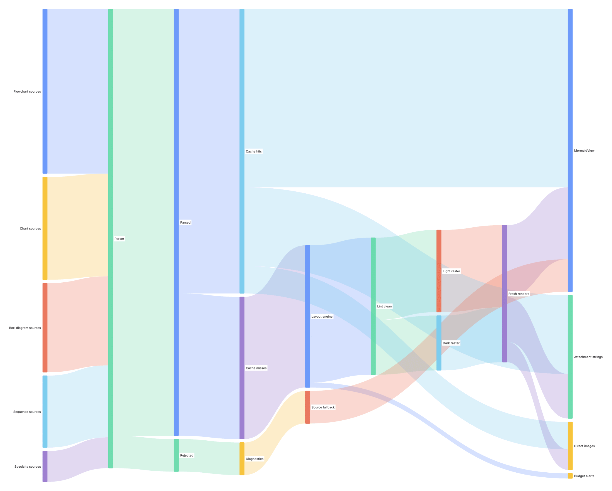

<p align="center">
  
</p>

# MermaidKit

Native [Mermaid](https://mermaid.js.org) diagrams in pure Swift — no
JavaScript, no WebView. Parse, lay out, and render **30 Mermaid diagram
types**, drawn with CoreGraphics/CoreText on Apple platforms and with Silica
(Cairo/FontConfig) on Linux.

As of **v2.0.0, MermaidKit renders natively on five platforms** — macOS/iOS,
Linux, **Android** (Kotlin + `Canvas`), **Windows/.NET** (SkiaSharp), and
**WebAssembly** — from one Swift layout core. A platform-free scene contract
(`SceneWire`) carries the fully-resolved diagram across the C ABI; each platform
paints it with a thin native renderer, and the core's output is proven
**byte-identical across all five** in CI. See
[`docs/notes/cross-platform-conformance.md`](docs/notes/cross-platform-conformance.md),
[`android/`](android/), and [`windows/`](windows/).

<picture>
  <source media="(prefers-color-scheme: dark)" srcset="docs/images/hero-dark.png">
  
</picture>

```swift
import MermaidRender

struct ReleaseFlow: View {
    var body: some View {
        MermaidView("""
        flowchart TD
            A[Start] --> B{Choice}
            B -->|yes| C[Do it]
            B -->|no| D[Skip]
        """)
    }
}
```

`MermaidView` follows the environment's light/dark scheme, sizes to the
diagram (scaling down, never up), and degrades unrecognized sources to
readable monospaced text. Prefer images? One call:

```swift
let image = MermaidRenderer.image(
    source: "sequenceDiagram\n  Alice->>Bob: Hello",
    theme: DiagramTheme(prefersDark: false)
)
```

## Why

Embedding Mermaid today usually means shipping mermaid.js inside a
`WKWebView`: a JS runtime per diagram, async round-trips, non-native text,
and a web process in your memory footprint. MermaidKit renders the same
source natively and synchronously — most diagram types render cold in
**under ~15 ms** on Apple silicon (worst ~25 ms, a dense sankey; parse
sub-millisecond), and results are cached per (source, theme, spacing).

|  | MermaidKit | mermaid.js + WKWebView | [BeautifulMermaid](https://github.com/lukilabs/beautiful-mermaid-swift) |
|---|---|---|---|
| Diagram types | **30** | all | 6 |
| Native platforms | **macOS, iOS, Linux, Android, Windows, WASM** | anywhere a webview runs | Apple |
| Runtime | Swift + CoreGraphics | JS engine + web process | Swift (elk-swift layout) |
| Dependencies | **none** | mermaid.js bundle | elk-swift |
| Rendering | sync, ~ms, cached | async round-trip | sync + async |
| Output | `NSImage`/`UIImage`, PDF, SVG, `NSAttributedString`, SwiftUI | HTML/SVG in webview | image, SVG, ASCII |
| Layout engine | network-simplex layering, label-space reservation, fixed-side ports | dagre / ELK | elk-swift |
| Layout verification | **geometric linter in CI** + stability tests | — | — |
| Density control | `DiagramSpacing` presets | config | — |
| Syntax coverage | core syntax per type (see matrix) | reference | core syntax, 6 types |

If you need iOS 15 or pixel-parity with mermaid.js, those other rows are good
choices. MermaidKit's bet is breadth of *native* type coverage with zero
dependencies and machine-checkable layout quality (and it now exports SVG too —
see [SVG export](#svg-export-and-the-renderscene-ir)).

## The full set

Every type, rendered by MermaidKit itself, one image per diagram (light and
dark): **[docs/GALLERY.md](docs/GALLERY.md)**.

## Native on five platforms

One Swift layout core; a thin native renderer per platform. The parse → layout →
`RenderScene` pipeline is platform-free, so it cross-compiles to every target and
its output is **byte-identical across all five** (proven in CI —
[`cross-platform-conformance.md`](docs/notes/cross-platform-conformance.md)). The
fully-resolved scene crosses the C ABI as the language-neutral **`SceneWire`**
JSON; each platform paints it.

| Platform | Renderer | Bridge | Get it |
|---|---|---|---|
| macOS / iOS / visionOS | CoreGraphics / CoreText | in-process | `import MermaidRender` |
| Linux | Silica (Cairo/FontConfig) | in-process | `LinuxRaster` trait |
| **Android** | Kotlin `Canvas` (Skia) | JNI → `.so` | `implementation("ai.2389:mermaidkit-android:…")` — [`android/`](android/) |
| **Windows / .NET** | SkiaSharp | P/Invoke → `.dll` | `MermaidKit` NuGet — [`windows/`](windows/) |
| **WebAssembly** | SVG / Canvas2D | WASI | `swift build --swift-sdk …wasm` |

On Android, the whole integration is one line — and it themes itself to the app:

```kotlin
MermaidDiagram("flowchart LR\n A[Start] --> B[End]", Modifier.fillMaxWidth())
```

On Windows/.NET, a source string in, a Skia diagram out:

```csharp
var scene = MermaidNative.Scene("flowchart LR\n A[Start] --> B[End]");
new SceneRenderer().Draw(scene, canvas);
```

Both go **source string → native Swift core → `SceneWire` → native renderer**,
with no Swift toolchain or scene-building on the consumer's side. Android adds
Material theming (`MermaidTheme.fromMaterial`), device-font measurement, and
`contentDescription` from the narration; Windows the same shape via SkiaSharp.

## Beyond Mermaid: DOT, Dippin, SQL, and git-log front-ends

Mermaid is the primary input, but it isn't the only one. Four more front-ends
parse into the same IR (`Flowchart` / `ERDiagram` / `GitGraph`) and render
through the same layout and every backend — CoreGraphics/CoreText on Apple,
Silica/Cairo on Linux, and the terminal — with no re-serialization back to
Mermaid text:

- **Graphviz DOT** — `DOTParser.parse(_:)` turns a `.dot` source into a
  `Flowchart`, handling subgraphs/clusters, attribute defaults, `dir=back`, and
  shape mapping. The inverse ships too: `DOTExporter.export(_:)` emits a
  `Flowchart` back as DOT, so MermaidKit doubles as a **Mermaid ⇄ DOT
  converter** — flat charts round-trip exactly, clustered charts round-trip
  structurally.
- **Dippin** (`.dip`) — `DippinParser.parse(_:)` maps Dippin's eight node kinds
  (agent, tool, human, conditional, parallel, fan_in, subgraph, manager_loop)
  to flowchart shapes and collapses simple `when` equalities to concise edge
  labels.
- **SQL DDL** — `SQLDDLParser.parse(_:)` turns a `CREATE TABLE` schema dump into
  an `ERDiagram`: typed columns; `PRIMARY`/`FOREIGN`/`UNIQUE` keys, inline and
  table-level, rendered as `PK`/`FK`/`UK` badges (`ERDiagram.Attribute.keys`);
  and `REFERENCES` mapped to one-to-many crow's-foot relationships. It copes
  with dialect quoting (`"x"`, `` `x` ``, `[x]`) and comments, ignores unknown
  clauses, and degrades to `nil` on malformed or oversized input.
- **git log** — `GitLogParser.parse(_:)` turns raw `git log` output — piped
  straight in — into a `GitGraph`. Topology is resolved in two passes (so the
  parse never depends on the caller's `--date-order`/`--topo-order` choice), and
  branch lanes are derived from the ref decorations
  (`(HEAD -> main, origin/main)`), then propagated backward along first-parent
  ancestry so a feature branch's interior commits share the tip's lane.
  `mermaidkit-term --format gitlog` renders it straight to the terminal.

Each hands its parsed diagram straight to `MermaidRenderer.pngData(diagram:)` /
`image(diagram:)`.

## Supported diagram types — honestly

All 30 types parse their **core syntax** — the constructs in the mermaid.js
docs' primary examples, which is what the dense fixtures in
`Fixtures/diagrams/` exercise. MermaidKit is not a syntax-complete port of
mermaid.js, and the failure mode is deliberate:

- **Unknown diagram dialects** → `MermaidParser.parse` returns `nil`; hosts
  show the fenced source (that's what `MermaidView` does), and
  `MermaidParser.diagnose` explains why — with a did-you-mean for typos.
- **Styling/interaction directives** (`%%{init:}%%`, `classDef`/`class`,
  `style`, `linkStyle`, `click`) → **ignored, not fatal**: the diagram still
  parses and renders with MermaidKit's own theme. Ditto comments (`%%`).
- **Structural syntax that goes beyond the core** — much of it works:
  YAML front-matter (all types — the `title:` renders as mermaid.js's
  centred caption, other keys like `config:` are tolerated and ignored);
  `accTitle:`/`accDescr:` accessibility statements (all types — they feed
  the generated alt text and read back via `MermaidParser.metadata(in:)`,
  never appearing as content); flowchart chained edges
  (`A --> B --> C`), `&` fan-out, inline `-- text -->` labels,
  bidirectional `<-->`, min-length links, `--o`/`--x` heads, edge IDs,
  `:::class` tolerance, nested `subgraph` group boxes (with inner
  `direction` and edges that target a group id), the hexagon `{{ }}` and
  subroutine `[[ ]]` node shapes; the full everyday
  sequence set — combined
  fragments (`loop`/`alt`+`else`/`opt`/`par`/`critical`/`break`, nested)
  with `rect` bands, activation bars (`->>+`/`->>-`, `activate`), `box`
  groupings, notes with `<br/>` line breaks, `actor` figures, typed
  participants (`@{ "type": "database" }`), create/destroy, true arrow
  heads for every token (`-x`, `-)`, `<<->>`), autonumber badges; gantt
  directive lines (never phantom bars) and `y/M/s` durations; radar
  positional values; packet `+N` relative widths; treemap `:::class`;
  gitGraph `cherry-pick`; class generics `~T~`; ER attribute keys; state
  composites, forks, choices. Some still doesn't (flowchart
  `@{ shape }`). If your diagram parses but drops
  something you wrote, that's a gap: please
  [open an issue](#reporting-a-diagram-that-renders-wrong) with the source.

Not supported anywhere: HTML in labels other than `<br/>` line breaks
(sequence messages and notes honor `<br/>`; other tags render as text),
FontAwesome icons, click callbacks, animations, and mermaid.js theming
directives (theming is `DiagramTheme`'s job).

| Type | Header | Type | Header |
|---|---|---|---|
| architecture | `architecture-beta` | packet | `packet-beta` |
| block | `block-beta` | pie | `pie` |
| C4 | `C4Context`/`C4Container`… | quadrant | `quadrantChart` |
| class | `classDiagram` | radar | `radar-beta` |
| entity-relationship | `erDiagram` | requirement | `requirementDiagram` |
| flowchart | `flowchart`/`graph` | sankey | `sankey-beta` |
| gantt | `gantt` | sequence | `sequenceDiagram` |
| gitGraph | `gitGraph` | state | `stateDiagram-v2` |
| journey | `journey` | timeline | `timeline` |
| kanban | `kanban` | treemap | `treemap-beta` |
| mindmap | `mindmap` | xychart | `xychart-beta` |
| zenuml | `zenuml` | treeview | `treeView-beta` |
| venn | `venn-beta` | cynefin | `cynefin-beta` |
| wardley | `wardley-beta` | ishikawa | `ishikawa-beta` |
| eventmodeling | `eventmodeling` | swimlane | `swimlane-beta` |

## Performance

Cold parse → layout → render **to rasterized pixels** (the benchmark forces
rasterization — a deferred-drawing `NSImage` would flatter the numbers), best
of 3, on an Apple-silicon Mac
(the dense per-type fixtures in this repo — real-world diagrams are usually
smaller). Samples are round-robin across types (sequential per-type sampling
biased late types with accumulated heat — a measured 2x swing), best of
three rounds. `RenderBenchmarks` is a *correctness* smoke — every fixture must
parse, render, and rasterize — with **no wall-clock assertion** (timing gates
flake under CI load, so performance never gates a merge). The table below is
opt-in: `BENCH_TABLE=1 swift test --filter RenderBenchmarks` measures and
prints it. These numbers are machine-specific and drift run-to-run, so this
README keeps only a range, not a table that can re-drift.

On an Apple-silicon Mac, cold: **parse is sub-millisecond** for every type
except flowchart (~2 ms); **most types render under ~15 ms** total; the **worst
is a dense sankey at ~25 ms**, whose translucent flow ribbons dominate. The full
internally-consistent per-type table — and where the time actually goes, plus
whether any of it is worth optimizing — lives in
[`docs/notes/performance.md`](docs/notes/performance.md), the single source of
truth for these figures.

Rendering is synchronous by design: at these times a first render in a
SwiftUI `body` is cheaper than a state round-trip, and repeat renders hit the
cache. Input is bounded the same way mermaid.js bounds it:
`MermaidParser.maxTextSize` (50k chars) caps every source, and
`maxEdges` (500) caps flowcharts — the one type whose layered layout is
super-linear in edge count. Oversized sources return `nil` fast; per-type
numeric fields are clamped at parse (durations, bit ranges, tick counts).

Swift 6 language mode, zero concurrency warnings.

## Accessibility

Every diagram describes itself: `MermaidView` exposes a full content
description to VoiceOver ("Flowchart with 12 nodes and 14 connections:
Fenced mermaid block, ..."), `attachmentString` sets the same text on the
embedded image, and `MermaidRenderer.altText(source:)` hands it to hosts
directly. Descriptions are generated from the parsed model — type, honest
counts, leading names — deterministically, for all 30 types.

Beyond that one-liner, `MermaidAltText.narrate(_:)` produces a step-by-step
*walkthrough* — a richer companion to `describe`'s summary. It follows a
flowchart's edges through its decisions, reads a state machine from its initial
state, spells out an ER schema's cardinalities, and replays a sequence message
by message; every other type falls back to `describe`. Deterministic and
length-bounded, and it mirrors `describe`'s API (`narrate(_:)`,
`narrate(_:metadata:)`, `narrate(source:)`).

## Robustness

The parser and layout engines never crash on hostile input — empty/garbage
sources, 100k-character labels, deep nesting, duplicate/self-referencing
nodes, `NaN`/`Infinity`/`1e308` values, CRLF, RTL text. An adversarial suite
(`AdversarialInputTests`) runs the full parse → layout → lint pipeline on all
of it in CI. Numeric input is sanitized at the parser boundary
(non-finite rejected, magnitude clamped) so geometry can't be poisoned.

## Terminal rendering (experimental)

`mermaidkit-term` is a CLI that renders any Mermaid, DOT, or Dippin source
straight to the terminal — no display server, no window. It picks the best tier
the terminal will answer to: **Kitty graphics** (a real inline image) →
**half-block truecolor** (1×2 color pixels) → **colored box-drawing** → **plain
ASCII**, with OSC 11 background detection and capability probing to choose. It
lives in `MermaidLayout`, so it's platform-free and runs headless on Linux/CI.

```
swift run mermaidkit-term flowchart.mmd
cat pipeline.dot | mermaidkit-term --format dot --mode plain
```

## SVG export and the RenderScene IR

Every diagram also renders to a standalone SVG document — no CoreGraphics, no
platform image. `MermaidRenderer.svg(source:theme:)` returns the SVG string for
any of the **30 diagram types**; `MermaidRenderer.renderScene(source:theme:)`
hands back the `RenderScene` behind it.

```swift
let svg = MermaidRenderer.svg(
    source: "flowchart TD\n  A --> B",
    theme: DiagramTheme(prefersDark: false)
)   // -> "<svg …>…</svg>"
```

`RenderScene` is a new public, `Codable`, **platform-free** render IR (in
`MermaidLayout`): a complete display list — shaped nodes, arrowed edges, text,
containers — with every shape's geometry resolved exactly once, so a backend
just paints primitives in order rather than re-deriving a diamond's vertices or
a cylinder's arcs. Every diagram type lowers to it, and the SVG backend
(`SVGRenderer`) consumes `RenderScene` alone — it needs no drawing surface, so
the scene → SVG path runs headless on Linux and in CI. Because the whole tree is
`Codable`, a scene can also cross a process boundary intact; a cross-process
determinism gate diffs both the raster and the RenderScene/SVG signatures in CI.

`RenderScene` — projected to the explicit, language-neutral **`SceneWire`** JSON
contract — is the foundation for the shipped **Android** and **Windows/.NET**
renderers and the WebAssembly build. Each consumes the same scene and paints it
natively (Android with `Canvas`, Windows with SkiaSharp), so all thirty diagram
types render on every platform with no per-type work on the consumer side. The
core's `SceneWire`/SVG output is byte-identical across macOS, Linux, Android,
WASM, and Windows (CI-gated) — see
[`docs/notes/android.md`](docs/notes/android.md),
[`docs/notes/windows.md`](docs/notes/windows.md), and
[`docs/notes/cross-platform-conformance.md`](docs/notes/cross-platform-conformance.md).

## Architecture

Two targets:

- **MermaidLayout** — platform-free. `MermaidParser.parse(String)` →
  per-type models → `DiagramLayoutEngine.layout(_:measure:)` → pure geometry
  (frames, polylines). Text measurement is injected (`DiagramTextMeasurer`),
  so layout is fully testable without a display server.
- **MermaidRender** — CoreGraphics/CoreText drawing on macOS 14+, iOS 17+,
  and visionOS 1+, and optional Silica (Cairo/FontConfig) drawing on Linux.
  The Linux raster backend is behind the `LinuxRaster` **package trait** (default
  OFF): a `from:`-pinned consumer resolves a Silica-free graph on every platform
  — no unstable branch dependency, and Apple hosts never fetch the Cairo/PureSwift
  stack. Linux users opt in with `.package(url: …, from: "2.0.0", traits:
  ["LinuxRaster"])` (or `swift build --traits LinuxRaster`). Building requires
  Xcode 26 / Swift 6.2 (package traits, and Silica's graph when enabled, set that
  toolchain floor). The styling inputs are `DiagramTheme` (six colors, a
  categorical palette, and a dark-mode flag) and `DiagramSpacing` (layout
  density).

The layered types (flowchart, class, ER, state) use network-simplex layer
assignment — the same strategy ELK Layered and Graphviz dot default to —
with label-space reservation and declaration-order stability, so diagrams
stay compact, labels stay readable, and small edits don't reshuffle the
layout (all three properties are enforced by tests).

### The layout linter

MermaidLayout includes something unusual: every diagram lowers to a
`DiagramScene` — a `Codable`, machine-readable IR of boxes, edge routes, and
labels — and `DiagramLayoutLinter` checks it against geometric invariants of
good layout (no edge through a box, no edge slicing through bare label text,
no overlapping nodes, no off-canvas or colliding labels, no marks escaping a
plot). The linter runs in this
package's test suite over dense fixtures for all 30 types, so layout
regressions fail CI as *geometry* ("edge #3 passes through node 'DiagramScene' (165pt inside)"), not as pixel diffs.

The scene IR is also the extension seam — and it's now realized across five
platforms. Alongside the lint-focused `DiagramScene`, a render-focused
`RenderScene` (see [SVG export](#svg-export-and-the-renderscene-ir)) lowers from
every type and is consumed by the built-in `SVGRenderer` to export standalone
SVG, all inside the platform-free `MermaidLayout` target without touching parsing
or layout. Projected to the `SceneWire` JSON contract and crossed via the C ABI,
that same scene now drives the shipped native **Android** (Kotlin `Canvas`) and
**Windows/.NET** (SkiaSharp) renderers and the WebAssembly build
(`docs/notes/android.md`, `docs/notes/windows.md`). Further backends welcome.

## API

- `MermaidView(source, theme:spacing:)` — SwiftUI drop-in; theme defaults
  to the environment color scheme; `spacing` is the density knob
  (`.compact` / `.regular` / `.comfortable`, or custom gaps — consulted by
  flowchart, class, ER, state, and architecture layouts).
- `DiagramTheme` — six colors + a categorical `palette` (node tints, pie
  slices, sankey bands…); override the palette to re-skin all 30 types at
  once. See the Theming article in the DocC docs.
- `MermaidRenderer.image(source:theme:spacing:)` — one-shot render,
  auto-sized; `renderImage(...)` is the async sibling that renders off the
  calling thread and propagates cancellation (deliberately a distinct name,
  so the cheap sync cache-hit path stays reachable from async contexts).
- `MermaidRenderer.attachmentString(source:theme:spacing:)` — the diagram
  as a single-attachment `NSAttributedString` for embedding in text views.
- `MermaidRenderer.pdfData(source:theme:spacing:)` — single-page vector
  PDF from the same layout and draw code; the export/print path.
- `MermaidRenderer.svg(source:theme:spacing:)` — a standalone SVG document for
  any of the 30 types, and `MermaidRenderer.renderScene(source:theme:spacing:)`
  the platform-free `RenderScene` behind it.
- `RenderScene` / `SVGRenderer` (in `MermaidLayout`) — the `Codable`,
  CoreGraphics-free render display list and its SVG backend; consume
  `RenderScene` to reach a new output format without touching parsing or layout.
- `MermaidRenderer.pngData(diagram:)` / `image(diagram:)` /
  `rgbaRaster(diagram:)` — render an already-parsed `MermaidDiagram` without
  re-serializing to Mermaid text; the path the DOT/Dippin/SQL front-ends take.
- `DOTParser.parse(_:)`, `DippinParser.parse(_:)`, `SQLDDLParser.parse(_:)`,
  `GitLogParser.parse(_:)` — the non-Mermaid front-ends (Graphviz DOT, Dippin,
  SQL DDL, and `git log` output → gitgraph) into the same IR;
  `DOTExporter.export(_:)` is the inverse (Flowchart → DOT).
- `MermaidRenderer.altText(source:)` — a VoiceOver-ready description of
  the diagram's content, and `MermaidAltText.narrate(source:)` a step-by-step
  walkthrough (see Accessibility above).
- `MermaidRenderer.textMeasurer` — the renderer's own CoreText measurer;
  pass it to `DiagramLayoutEngine.layout` / `DiagramScene.lower` when you
  want layout or lint geometry to match the render exactly.
- `MermaidParser.parse(_:)`, `MermaidDiagram.typeName`, and the per-type
  layout engines are public for hosts that want geometry without pixels.
- `MermaidParser.diagnose(_:)` — why a source failed to parse, with line
  numbers and did-you-mean suggestions for typo'd headers.

## Documentation

DocC catalogs ship with the package (Xcode: Product → Build Documentation;
Swift Package Index hosts them):

- **MermaidRender** — Getting Started · Theming (brand themes, palettes,
  canvas rules) · Embedding in Text Views
- **MermaidLayout** — Headless Layout (measurer injection, other backends,
  programmatic diagrams) · Scene Geometry and Linting · **Adding a Diagram
  Type** (the full five-file walkthrough)

Plus [CONTRIBUTING.md](CONTRIBUTING.md) for the review rules (geometry-first)
and the most-wanted list.

## FAQ

**Does it render on Linux?** Yes, since v0.11.0 — `MermaidRender` draws with
Silica (Cairo/FontConfig) on Linux, sharing the exact layout and per-type draw
code as the Apple backend (`docs/notes/linux-rendering-via-silica.md`). The
layout target (`MermaidLayout`) was always platform-free — and a vector SVG
backend over the scene IR now ships from there too:
`MermaidRenderer.svg(source:theme:)` exports standalone SVG for all 30 types via
the CoreGraphics-free `SVGRenderer` (see
[SVG export](#svg-export-and-the-renderscene-ir)).

**Does it run on Android / Windows / the web?** Yes — natively, as of v2.0.0.
The Swift layout core cross-compiles to each; a thin native renderer paints the
shared `SceneWire` scene (Kotlin `Canvas` on Android, SkiaSharp on Windows/.NET,
SVG or Canvas2D on WebAssembly). An app passes a Mermaid *source string* and gets
a drawn diagram — no Swift toolchain of its own. See [`android/`](android/),
[`windows/`](windows/), and the platform notes in `docs/notes/`.

**Is the output really the same on every platform?** The scene is: the core's
`SceneWire`/SVG output is byte-identical across macOS, Linux, Android, WASM, and
Windows, checked on every push by a
[conformance gate](docs/notes/cross-platform-conformance.md). Getting there
surfaced (and fixed) two real cross-platform determinism bugs — a `Double`→JSON
formatting difference between Foundation implementations, and a `ceil` that
amplified a 1-ULP `sin`/`cos` difference in pie tessellation.

**Why doesn't the output look exactly like mermaid.js?** Deliberate.
MermaidKit renders diagrams in a native Apple aesthetic (system fonts, your
theme's colors) rather than pixel-cloning mermaid.js's default skin. Same
structure, native skin.

**Why macOS 14 / iOS 17?** Those are the floors of the app MermaidKit was
extracted from. Nothing fundamental blocks lower floors; it's tracked, and
PRs verifying older OSes are welcome.

**Is it safe to render untrusted input?** That's the design point of the
input caps, numeric sanitation, and the adversarial suite. No network, no
JS, no dynamic code — parse and draw.

## Reporting a diagram that renders wrong

Open an issue with (1) the Mermaid source, (2) what you expected (a
mermaid.live screenshot is perfect), (3) what MermaidKit did. Parser gaps
are usually small, contained fixes — the per-type parser + layout + renderer
files are deliberately independent.

## License

MIT.
