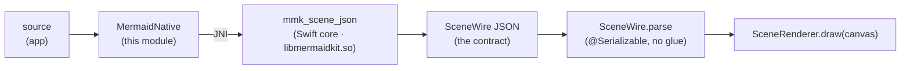
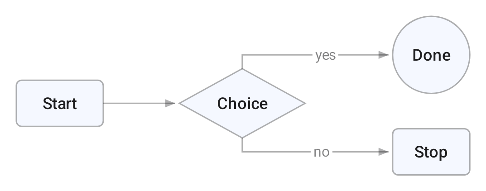

# MermaidKit for Android (Kotlin rendering half)

The Android bridge described in [`docs/notes/android.md`](../docs/notes/android.md).
An app hands over a Mermaid **source string**; `MermaidNative` parses it natively
(JNI → the Swift `mmk_*` C ABI in `libmermaidkit.so`) into a platform-free
**`SceneWire`** scene, and `SceneRenderer` draws it with a real Android
`Canvas`/`Paint`.



## Installation

The library ships as an `.aar` with prebuilt native `.so` for all three ABIs
(`arm64-v8a`, `armeabi-v7a`, `x86_64`) — the consumer never touches Swift, the
NDK, or JNI.

```kotlin
// build.gradle.kts
implementation("ai.2389:mermaidkit-android:0.1.0")
```

Until it's on Maven Central, publish it to your local Maven repo first (the AAR's
native libs are cross-compiled in Docker, so Docker + a native x86_64 host are
needed to build it — see `android/native/`):

```bash
# from android/ — build all three ABIs, then assemble + publish the AAR:
for abi in arm64-v8a armeabi-v7a x86_64; do
  docker run --rm -v "$PWD/..":/MermaidKit \
    -v "$PWD/mermaidkit/src/main/jniLibs/$abi":/out \
    swift-android-6.2 bash /MermaidKit/android/native/build-jni.sh "$abi"
done
./gradlew :mermaidkit:publishReleasePublicationToMavenLocal   # → mavenLocal()
```

> Size: one ABI's native payload is ~64 MB (the Swift runtime + Foundation/ICU),
> stripped. With per-ABI APK splits or an app bundle, a device downloads only its
> own ABI. Trimming the Foundation/ICU surface is the main size lever, and a
> follow-up.

Because [`RenderScene`](../Sources/MermaidLayout/RenderScene.swift) flattens all
30 diagram types into a tiny universal vocabulary (shape / polyline / text + a
theme), this module never needs to know what a "sequence diagram" is — it just
paints primitives in painter's order, exactly like the SVG backend.

## Rendering a diagram (the snap-in surface)

Compose:

```kotlin
MermaidDiagram(
    source = "flowchart LR\n  A[Start] --> B{Choice}\n  B -->|yes| C((Done))",
    modifier = Modifier.fillMaxWidth(),
)   // sizes to width, uses the app's MaterialTheme colors (light/dark),
    // narration → contentDescription. Override with `theme = MermaidTheme.fromMaterial(...)`.
```

Classic View (no Compose dependency):

```kotlin
val view = MermaidView(context)
view.source = "flowchart LR\n A[Start] --> B[End]"   // that's it — parses, sizes, draws
```

Both go source → native parse → `SceneWire` → `Canvas`, measure text with the
drawing `Paint`, and set the diagram's accessibility narration as
`contentDescription`. For lower-level control, `MermaidNative.scene(source,
measurer = PaintMeasurer(paint))` returns a `SceneWire` you draw yourself with
`SceneRenderer`.



*Above: a flowchart drawn by `SceneRenderer` through a real android-34 emulator's
Skia `Canvas`, from the `SceneWire` JSON the Swift pipeline emitted — captured by
the instrumented test (`connectedDebugAndroidTest`).*

## Layout

- `mermaidkit/src/main/kotlin/ai/mermaidkit/scene/SceneWire.kt` — the wire model:
  plain `@Serializable` data classes with a `type` discriminator. Deserializes
  the exact JSON the C ABI emits with **zero custom serializers**.
- `mermaidkit/src/main/kotlin/ai/mermaidkit/scene/SceneRenderer.kt` — draws a
  `SceneWire` onto a `Canvas`: rounded rects / ellipses / polygons / arbitrary
  paths, stroked+arrowed edge polylines, and centered/rotated text with backing
  chips. Colors are `#RRGGBBAA` (8-bit, what Skia draws at); text is measured
  with the same `Paint` that draws it (the measure seam the C ABI callback pins).
- `mermaidkit/src/test/…/SceneWireTest.kt` — JVM unit tests that parse golden
  JSON captured from the real pipeline (`src/test/resources/*.json`).
- `mermaidkit/src/main/kotlin/ai/mermaidkit/MermaidNative.kt` — the native bridge:
  `System.loadLibrary("mermaidkit")` + `external fun`s over the `mmk_*` C ABI.
  `MermaidNative.scene(source)` goes straight from a source string to a `SceneWire`.
  `PaintMeasurer.kt` backs the measure seam with an Android `Paint`.
- `mermaidkit/src/main/kotlin/ai/mermaidkit/MermaidView.kt` /
  `MermaidDiagram.kt` — the snap-in surface: a classic `View` (no Compose dep) and
  a `@Composable`, each rendering a source string in one line (see above).
- `native/` — the JNI native side: `Sources/MermaidJNI/mermaidkit_jni.c` (the C
  shim) and its own `Package.swift`. `build-jni.sh` cross-compiles it with the
  Swift Android SDK into `libmermaidkit.so` (the shim + `MermaidKitC` linked in)
  plus the transitive Swift-runtime `.so` closure — the AAR's `jniLibs/<abi>/`.
- `mermaidkit/src/androidTest/…/RenderInstrumentedTest.kt` — draws a scene through
  the emulator's Skia `Canvas` and asserts real ink lands.
- `mermaidkit/src/androidTest/…/NativeBridgeTest.kt` — the full seam on-device:
  source string → JNI → Swift → `SceneWire` → render.

## Build & test

```bash
# 1. Cross-compile the native .so bundle into jniLibs (needs Docker; per ABI):
docker run --rm -v "$PWD/..":/MermaidKit \
  -v "$PWD/mermaidkit/src/main/jniLibs/x86_64":/out \
  swift-android-6.2 bash /MermaidKit/android/native/build-jni.sh x86_64

# 2. Library AAR + JVM unit tests + instrumented-test APK (no device needed):
./gradlew :mermaidkit:assembleDebug :mermaidkit:testDebugUnitTest :mermaidkit:assembleDebugAndroidTest

# 3. On-device tests — render + the native JNI seam (needs an emulator, i.e. KVM):
./gradlew :mermaidkit:connectedDebugAndroidTest
```

The `jniLibs` `.so`s are **build artifacts** (gitignored) — CI (and a release
build) run step 1 to produce them. AAPT2 ships x86_64-only, so the Gradle build
must run on a native x86_64 host, and the emulator needs KVM — see
`.github/workflows/ci.yml` (the `android-aar` job builds all three ABIs,
assembles the release AAR, and publishes it to a local Maven repo as a dry run).

The **device measure seam** is wired: pass a `MermaidNative.Measurer` (use
`PaintMeasurer` over your drawing `Paint`) to `MermaidNative.scene(source,
measurer = …)` and native layout measures text with the same face that draws it
— a C trampoline bridges each measure request back into Kotlin on the JNI thread.

## Theming

`MermaidDiagram` defaults to the app's Material colors — `MermaidTheme.fromMaterial(MaterialTheme.colorScheme)`
— so diagrams match the surrounding UI (light/dark included) automatically. Pass
an explicit `theme` (Compose) or set `MermaidView.theme` (View) to override.
Under the hood the theme crosses the C ABI as `ThemeWire` JSON (`#RRGGBBAA`
colors + `prefersDark`) to `mmk_scene_json_themed`, which paints the scene with
those colors instead of a built-in preset.

## Not yet here (next slices)

- **`onNodeClick(nodeId)` hit-testing** — needs the ABI to emit a node→rect map
  alongside the scene; `SceneWire` is flattened primitives with no node identity.
- **Maven Central push** — the AAR builds, bundles all three stripped ABIs, and
  publishes to a local repo today (verified: a fresh consumer app resolves
  `ai.2389:mermaidkit-android:0.1.0` and packages the `.so` into its APK). Pushing
  to Central still needs credentials + namespace verification + signing.
- **Native size** — trim the Foundation/ICU surface to shrink the ~64 MB/ABI
  payload.
