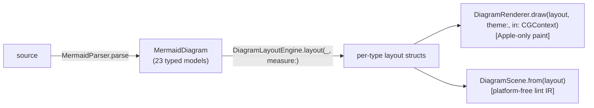

# Compiling MermaidKit's IR to targets beyond NSImage/UIImage

Design memo · 2026-07-08 · based on reading the working clone at
`scratchpad/mermaidkit-ios` (MermaidLayout + MermaidRender as published).

## 0. What actually exists (verified)

Pipeline today:



- `DiagramScene` (Sources/MermaidLayout/DiagramScene.swift:12–94) is three
  flat lists — `Node {id, frame, isContainer}`, `Edge {polyline, label?}`,
  `Label {text, frame, anchorEdge?, backed}` — plus `name` and `size`. Its
  own doc comment says what it is: a description of *what a laid-out diagram
  is*, "independent of how it's painted." It feeds `DiagramLayoutLinter`
  (same file, :118–267) and `DiagramSceneDiff` (stability tests). Nothing
  renders from it.
- `DiagramRenderer` draws from the **per-type layout structs**, not the
  scene (DiagramRenderer.swift:65–164, the 23-case switch), themed by
  `DiagramTheme` (DiagramTheme.swift:12–42: 6 colors + categorical palette,
  `PlatformColor` throughout).
- Text measurement is injected everywhere
  (`DiagramTextMeasurer: (String, Double) -> CGSize`; the renderer supplies
  CoreText via `MermaidRenderer.textMeasurer`, MermaidRenderer.swift:62–64;
  the lint tests deliberately supply a fake
  `count × size × 0.6` measurer, LayoutLintTests.swift:14–17, and all 23
  fixtures lay out clean under it). **Layout geometry is a function of the
  measurer** — this is the single most important fact for any new target.

## 1. Gap analysis: DiagramScene as a render IR

Enumerated against what the renderers actually draw. DiagramScene is a
*topology + collision* IR; roughly 40% of the paint information exists in
it, and the missing 60% is exactly the part a backend needs.

| Missing class | Concrete evidence |
|---|---|
| **Shape kinds** | Flowchart nodes carry `shape` (rectangle/rounded/stadium/circle/diamond/cylinder/stateStart/stateEnd) consumed in DiagramRenderer+Flowchart.swift:81–96; the scene lowers every one to a bare `frame` (DiagramScene+Flowchart.swift:18–20). A diamond and a cylinder are indistinguishable in the scene. |
| **Curves** | Scene edges are polylines only. Sankey bands are cubic Béziers (DiagramRenderer+Sankey.swift:22–26), gitgraph/mindmap links are curves (+GitGraph.swift:30, +Mindmap.swift:26), pie slices are arcs (+Pie.swift:31), cylinder caps are quad curves (+GraphShared.swift:252–272). The rounded-corner elbow treatment (`appendRoundedPolyline`, +GraphShared.swift:49–66, radius-5 arcs clamped to half-segment) exists only at draw time. |
| **End markers** | Arrowheads (8.5pt, 0.40 rad spread, canvas-fill-then-color double fill — +GraphShared.swift:84–104), UML relation markers (hollow inheritance triangle, filled/hollow composition/aggregation diamond, 3pt standoff — DiagramRenderer+Class.swift:78–128), ER crow's feet. None exist in the scene; the linter's `contentBounds` marker-reach fudge (Primitives.swift:66–82, "10pt covers every marker") exists precisely because markers aren't first-class. |
| **Stroke/fill/style semantics** | Renderers derive roles at draw time: `theme.ink.withAlphaComponent(0.35)` stroke, `theme.accent.withAlphaComponent(0.06)` fill (+Flowchart.swift:16–17), hairline at 0.18 (+Class.swift:17), 1pt line width, `[4,3]` dash for dashed edges (+GraphShared.swift:37), palette-by-`colorIndex` for pie/sankey/gantt. Scene has zero style. |
| **Text runs** | Scene node labels are just `Node.id`; no font size/weight/color/alignment. The renderers use a 7.5–12.5pt ramp with regular/medium/semibold weights (grep: 10 distinct sizes, 3 weights), left-aligned compartment rows (class attributes/methods, +Class.swift:57–74 — these rows don't exist in the scene at all: one Node per class box), rotated y-axis labels (Primitives.swift:94–104). Free-standing `Label` frames are *estimated* at `count × 6 × 14` (PolylineGeometry.swift:51–53) while the renderer measures with CoreText — a known, tolerated drift in a lint IR, disqualifying in a render IR. |
| **Label chips** | `backed: Bool` records *that* a chip exists, not its geometry (3pt pad, canvas fill — +GraphShared.swift:189–198). |
| **Z-order** | Implicit in imperative draw order and it varies: flowchart paints edges *then* nodes over the stubs (+Flowchart.swift:41→54); class paints edges then boxes; arrowheads over shafts; edge labels over everything. Scene lists are unordered. |
| **Compartments/chrome** | Class name-row separators, gantt grid, sequence lifelines/activations, legend swatches, diagram titles (12.5pt semibold at y=14, Primitives.swift:86–90) — absent. |

Conclusion: DiagramScene cannot be promoted to a render IR by adding a field
or two. Making it paint-complete means re-stating essentially everything in
the 23 `DiagramRenderer+*.swift` files inside the 23 `DiagramScene+*.swift`
lowerings — see §2a.

## 2. Architectures

### (a) Enrich DiagramScene into a full paint scene graph

Every per-type lowering emits shapes/markers/text-runs/styles; one backend
per format consumes the scene; the CG renderer is eventually rewritten to
consume it too.

- **Cost**: high. The 23 lowerings (today 26–93 lines each, ~1,200 LOC
  total) grow to duplicate the ~1,900 LOC of draw logic; then the CG path
  must be ported onto the scene or you have *three* statements of the truth.
- **Drift risk**: the killer. Until the CG renderer is ported, every visual
  tweak must be made twice (renderer + lowering), and nothing fails when
  someone forgets — the current `estimatedLabelSize` vs CoreText-measure
  drift shows this already happens even with the tiny scene.
- **Linter impact**: negative. The linter wants boxes and routes; burying
  them in paint commands means either keeping a semantic layer anyway (so
  you've built two IRs and called them one) or teaching the linter to
  reconstruct semantics from paint. The scene's smallness is a feature —
  its doc comment and `DiagramSceneDiff` both depend on it staying
  semantic and stable.
- **Verdict**: wrong direction. Don't grow the lint IR into a paint IR.

### (b) Per-target renderers over the typed layouts

`SVGRenderer.draw(_: FlowchartLayout, …)` etc., parallel to today's CG path.

- **Cost**: ~1,900 LOC of drawing decisions re-implemented *per target*,
  and every future diagram type costs N implementations.
- **Drift risk**: guaranteed. The CG renderer encodes dozens of unwritten
  visual decisions (3pt arrow gap, alpha-batched dash groups so crossing
  translucent edges don't stack into dark seams, marker standoffs, label
  keep-out zones in `labelAnchor`, +GraphShared.swift:124–184). A second
  renderer will silently diverge on all of them.
- **Verdict**: fine for exactly one extra target if it were free; it isn't.

### (c) Middle path — a DrawList behind a canvas protocol (recommended)

The decisive finding: **the renderers' CGContext usage is already a tiny,
closed command set.** Tallying every `context.*` call across all 23 draw
files:

```
save/restoreGState, setFillColor, setStrokeColor, setLineWidth,
move/addLine/addQuadCurve/addCurve/addArc(+tangent)/addEllipse/closePath,
beginPath, strokePath, fillPath, drawPath(.fillStroke), addPath,
fill(rect), fillEllipse, strokeEllipse, stroke(rect),
setLineDash, setLineCap, setLineJoin, translateBy, rotate
```

No clipping. No gradients. No shadows. No blend modes. No image drawing.
Text goes through exactly four helpers (`drawText`, `drawTextLeft`,
`drawTextRotated`, `drawDiagramTitle` — Primitives.swift), all of which
bottom out in one `CTLineDraw` with (text, center, size, weight, color).
That is a ~15-op abstract canvas plus one text op.

**Shape**: define in a new platform-free target (or MermaidLayout):

```swift
public protocol DiagramCanvas {
    // path building
    func move(to: CGPoint); func addLine(to: CGPoint)
    func addQuadCurve(to: CGPoint, control: CGPoint)
    func addCurve(to: CGPoint, control1: CGPoint, control2: CGPoint)
    func addArc(center: CGPoint, radius: CGFloat, start: CGFloat, end: CGFloat, clockwise: Bool)
    func addArc(tangent1End: CGPoint, tangent2End: CGPoint, radius: CGFloat)
    func addEllipse(in: CGRect); func closePath()
    // painting
    func fill(_ rule: FillRule); func stroke(); func fillStroke()
    // state
    func setFill(_ c: DiagramColor); func setStroke(_ c: DiagramColor)
    func setLineWidth(_ w: CGFloat); func setDash(_ lengths: [CGFloat])
    func setLineCap(_: LineCap); func setLineJoin(_: LineJoin)
    func saveState(); func restoreState()
    func translate(by: CGPoint); func rotate(by: CGFloat)
    // text (measurement stays the injected DiagramTextMeasurer)
    func drawText(_ s: String, center: CGPoint, size: CGFloat,
                  weight: FontWeight, color: DiagramColor)
}
```

The refactor of the 23 draw files from `in context: CGContext` to
`on canvas: DiagramCanvas` is *mechanical* — the calls map 1:1. A
`CGCanvas` adapter keeps the image path byte-identical (verifiable against
the existing gallery renders). An `SVGCanvas` emits elements. A
`RecordingCanvas` produces a Codable `DrawList` for golden tests and for
replay-style backends (PDF, TikZ) written later without touching the
renderers again.

**The real migration cost is color, not drawing.** The draw files take
`PlatformColor` from `DiagramTheme` (Apple-only, MermaidRender/
DiagramTheme.swift) and resolve through `resolvedCGColor` (Platform.swift).
A platform-free canvas needs a value color — `DiagramColor {r,g,b,a}` with
an optional light/dark pair — and a platform-free theme
(`DiagramPaintTheme`) that `DiagramTheme` converts into (its `fingerprint`
code already resolves every color to sRGB components under a pinned
appearance, DiagramTheme.swift:53–88, so the conversion machinery exists).
This can be staged: keep the protocol generic over a `Color` associated
type at first, or land `DiagramColor` in one go — the latter is cleaner and
`themeDynamic` colors resolve at theme-construction time per appearance.

**What each side wins/loses**
- One statement of every visual decision (the current draw files remain the
  single source); new diagram types cost one draw function, all targets
  inherit it.
- The linter keeps its small semantic scene *unchanged*. Optionally gains a
  second, paint-level check: `DrawList` goldens per fixture (Codable diff,
  same discipline as `DiagramSceneDiff`) catch unintended paint changes
  deterministically on Linux CI — pixel-diff value without pixels.
- Loss vs (a): backends replay commands, so a backend can't easily do
  target-idiomatic restructuring (e.g. an SVG `<g>` per node with a
  semantic `id`). Mitigation that stays cheap: add two optional grouping
  ops (`beginGroup(id:)/endGroup`) the CG adapter ignores; renderers call
  them at natural block boundaries.

## 3. Per-target notes

### SVG (build this)

- Emission is direct: `viewBox="0 0 W H"` from the padded canvas size
  (coordinates are already y-down, matching SVG); paths → `<path d="…">`
  (the tangent-arc elbow maps to `A`/`Q`); dash → `stroke-dasharray="4 3"`;
  alpha → `rgba()`/`fill-opacity`. The renderer's canvas-fill-then-color
  double-fill hack for arrowheads (needed in CG to stop translucent stacking)
  translates literally and correctly.
- **Text**: `<text text-anchor="middle">` self-centers in the *viewer's*
  font, so measurement error appears only as overflow, never as
  misalignment. Add `textLength="{measured}" lengthAdjust="spacingAndGlyphs"`
  and the browser is *forced* to render each string at exactly the width
  layout reserved — geometry fidelity guaranteed at the cost of ≲5% glyph
  tracking distortion. This is the highest-leverage single attribute in the
  whole design. Font stack:
  `-apple-system, "SF Pro Text", "Helvetica Neue", "Segoe UI", Arial, sans-serif`;
  weights map to 400/500/600.
- **Do not embed SF** — Apple's license does not permit redistribution.
  Embedding a libre face (e.g. Inter) as a woff2 data URI is possible
  (~100 KB per SVG or an external ref) but should be an option, not the
  default.
- **Dark mode**: emit the six theme roles + palette as CSS custom properties
  on the root `<svg>`, with a `@media (prefers-color-scheme: dark)`
  override block in an inline `<style>`. Media queries apply even when the
  SVG is loaded via `` in modern browsers. API takes a light/dark
  theme pair (or one theme → single-appearance output).

### ASCII / Unicode (honesty section)

Quantizing the existing pt geometry does not work. A terminal cell is
~8×16pt of layout space; a typical flowchart node (say 110×36pt) becomes
14×2 cells — border and label collapse onto each other; orthogonal routes
land on half-cells; the dense fixtures (23-node architecture, the class
fixture) become soup. **ASCII is not a backend of the layout; it is a
different layout over the same parsed models.** The correct construction —
and the codebase is already shaped for it — is to run the *existing layout
engines* with a monospace measurer (`width = count × cellW`,
`height = cellH`) and grid-snapped spacing constants so quantization is
exact by construction, then rasterize boxes/edges into a character grid
with `─│┌┐└┘├┤┬┴┼▲▼◄►`. LayoutLintTests proves the layouts already tolerate
a linear fake measurer, so this path is exercised, not speculative.

Which types survive:
- **Good**: sequence (the classic ASCII art form — lifelines are columns),
  gantt (bars → `▓` runs on a week grid), packet (already a bit grid),
  timeline, journey, kanban (columns of boxes), gitgraph (`git log --graph`
  is the native idiom), pie (legend + percentages, skip the disc), treemap
  (nested rects quantize acceptably), class/ER *boxes* (compartment tables
  are natural; the relationship routing is the hard part).
- **Poor-to-hopeless**: mindmap (radial), sankey (curved proportional
  bands), radar, quadrant scatter, xychart lines (block/braille bars only),
  C4/architecture (icon-and-band aesthetics), flowchart with diamonds and
  dense orthogonal routing — doable (graph-easy exists) but it is a new
  router, weeks of work, and the output value is low beyond novelty.

Recommendation: if built at all, ship it for the "good" list only, as
`MermaidText.render(source:) -> String?` returning nil for unsupported
types — consistent with the package's existing "honest coverage matrix"
culture. Genuinely useful for CLI tools, agent/LLM contexts, and
accessibility fallbacks; but it is its own project (est. 2–4 weeks for the
good list), not a weekend backend.

### PDF

- **Apple, today, nearly free**: `CGContext(consumer:mediaBox:)` PDF
  context + the existing draw closures, unchanged — vector output with real
  text, ~50–80 LOC including the flip transform.
  `MermaidRenderer.pdfData(source:theme:spacing:)`. Do this first; it ships
  value while the canvas refactor proceeds. One caveat: dynamic
  `PlatformColor`s must be resolved under a pinned appearance exactly as
  the image path does (DiagramRenderer.swift:181–212) — PDF has no dark
  mode; pick the theme's appearance.
- **Platform-free PDF**: a pure-Swift emitter (xref tables, content
  streams, Base-14 fonts) is ~1–2k LOC and only sane as a `DrawList`
  replayer. Sweetener: Base-14 Helvetica has published AFM advance widths —
  the same metrics table doubles as the deterministic SVG measurer (§4).
  Defer until someone actually needs Linux PDF.

### Others (one line each, only the ones worth naming)

- **Alt-text / structured description**: `DiagramScene` is already
  "LLM/computer-readable" per its own doc comment — a
  `DiagramScene.accessibleDescription` (nodes, connections, reading order)
  is days of work, zero new architecture, and real accessibility value.
  Cheapest genuinely-useful target on the list.
- **TikZ**: the DrawList maps ~1:1 to `\draw`/`\node`; cheap once the
  DrawList exists; leave to a contributor, don't put in core.
- **Graphviz DOT**: discards MermaidKit's whole layout (DOT re-lays-out),
  only covers graph types — it's a *model* export, not a render target;
  skip.
- **HTML canvas JS emission**: SVG dominates it in every axis and the
  project's identity is "zero JS"; skip.
- **PowerPoint/DrawingML**: real demand, but OOXML shape emission is a
  swamp; PDF/SVG already paste into Keynote/PowerPoint; skip.

## 4. Text measurement — the crux

Every layout dimension that contains text is measurer-derived: node widths,
class-box row widths, edge-label chips, legend columns, gantt label
gutters. Rendering CoreText-measured geometry with a different font engine
misplaces *reserved space*, not just glyphs.

**Failure mode, quantified**: SF Pro vs Arial/Segoe advance widths differ
typically 3–8% per string (worst ~10% for narrow-glyph-heavy strings;
Helvetica Neue is closer, ~2–4%). A 150pt label in a browser font 6% wider
overflows 9pt — 4.5pt per side. Edge-label chips pad only 3pt
(+GraphShared.swift:191), so the chip stops masking the line and the text
collides with the route it sits on; class boxes clip their member rows;
`.compact` spacing (12pt-class gaps) starts producing label-label
collisions the linter would have caught had it seen the real widths.

Mitigations, ranked by cost-effectiveness:

1. **`textLength` + `text-anchor="middle"`** (SVG only, ~zero cost): the
   viewer is forced to honor layout's measured width. Distortion ≲5% is
   invisible at diagram label sizes. Default-on.
2. **Metrics-table measurer** (small, platform-free, the *correct* fix):
   ship `MetricsTableMeasurer` — per-character advance widths for one font
   the output declares first in its stack (Helvetica/Arial class metrics;
   ~1 KB table for Latin + an average-width fallback per script). Layout is
   then deterministic and identical on Linux CI, and the declared font is
   what browsers actually use. The measurer-injection seam means this needs
   **no engine changes** — it's an argument. The fake-measurer lint tests
   prove re-layout under a different measurer is a supported regime.
3. **Per-target measurer + re-layout as API stance**: never reuse
   CoreText-measured geometry for a non-CoreText viewer. The SVG entry
   point should *default* to (2) and merely *allow* passing
   `MermaidRenderer.textMeasurer` for Apple-only display (WKWebView showing
   the SVG uses SF anyway — that pairing is exact).
4. **Font embedding**: only fully authoritative option, but SF is
   unlicensable for embedding and libre-font embedding costs ~100 KB+ per
   file; offer as `SVGOptions.embedFont(data:metrics:)`, never default.

## 5. Recommendation — staged path

Respecting zero-dependency (all emission is string building in pure Swift)
and the geometry-lint discipline.

- **Stage 0 — PDF on Apple** (1–2 days). `MermaidRenderer.pdfData(...)`
  reusing the draw closures via a CGPDF context. Independent of everything
  below; immediate user value (print/export from Quoin).
- **Stage 1 — `DiagramCanvas` seam + `DrawList`** (1.5–2 weeks).
  `DiagramColor`/`DiagramPaintTheme` value types; mechanical port of the 23
  draw files from `CGContext` to the protocol; `CGCanvas` adapter.
  *Correctness gate*: existing image output must be pixel-identical
  (compare gallery renders before/after), and `RecordingCanvas` DrawList
  goldens land for all 23 fixtures using the metrics measurer — Codable
  diffs, run on Linux CI, the paint-level sibling of `DiagramSceneDiff`.
- **Stage 2 — SVG backend** (~1 week after stage 1).
  `MermaidSVG.render(source:theme:options:) -> String?` in a platform-free
  target, plus Apple-side sugar `MermaidRenderer.svg(source:theme:)` that
  bridges `DiagramTheme → DiagramPaintTheme`. Defaults: metrics-table
  measurer, `text-anchor + textLength`, CSS-variable theming with a
  `prefers-color-scheme` block from a light/dark theme pair.
  *CI verification*, in the house style (lint geometry, don't eyeball):
  (a) DrawList goldens (stage 1) already pin the commands the SVG is
  generated from; (b) SVG string snapshots per fixture (cheap, catches
  emitter regressions); (c) a ~200-line test-only SVG re-parser that
  extracts rects/paths/text frames and feeds them back through
  `DiagramLayoutLinter` for a handful of dense fixtures — closes the loop
  "the file a browser will draw is geometrically clean," which no snapshot
  can promise. Optional (d): one rendered-in-a-browser screenshot in the
  gallery workflow for human spot-checks, never as the gate.
- **Stage 3 (optional/community) — ASCII for the survivable types**
  (2–4 weeks). Sequence, gantt, packet, timeline, gitgraph, kanban via
  monospace measurer + grid-snapped spacing + character rasterizer.
  Returns nil for unsupported types, documented in the coverage matrix.
- **Alt-text generator over DiagramScene** (days) — schedule anywhere;
  no dependencies on the stages.

**Explicitly do not build**: an enriched paint-level DiagramScene (keep the
lint IR small and semantic); per-target renderers duplicating draw logic;
ASCII for flowchart/state/mindmap/sankey/radar; DOT/TikZ/PPTX/canvas-JS in
core; font embedding by default; a platform-free rasterizer.

**API sketch after stage 2**

```swift
// Apple (MermaidRender)
MermaidRenderer.image(source:theme:spacing:)      // existing
MermaidRenderer.pdfData(source:theme:spacing:)    // stage 0
MermaidRenderer.svg(source:theme:spacing:)        // sugar over MermaidSVG

// Platform-free (new target, builds on Linux)
MermaidSVG.render(source: String,
                  theme: DiagramPaintTheme.Pair,   // light+dark → CSS vars
                  spacing: DiagramSpacing = .regular,
                  options: SVGOptions = .init()    // measurer, font stack,
) -> String?                                       // embedding, textLength
```

Total to portable SVG: roughly 3–4 engineering weeks, almost all of it the
stage-1 mechanical port — which simultaneously buys PDF-anywhere, TikZ, and
DrawList golden tests for free afterward. The riskiest single line item is
keeping the CG adapter pixel-identical during the port; the gallery diff
makes that a checkable claim rather than a hope.
