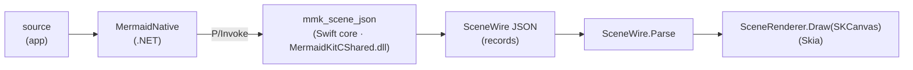

# MermaidKit on Windows: a native .NET renderer

The same playbook that took MermaidKit to Android, applied to Windows/.NET — and
standing on the [cross-platform conformance](cross-platform-conformance.md) proof
that the core already produces byte-identical scenes on Windows.

## The decision: SkiaSharp, not SVG, not Direct2D-only

| Option | Fidelity | Utility | Testability | Verdict |
|--------|----------|---------|-------------|---------|
| SVG → WebView2 | High (browser) | Poor — a web view, not a native surface | Easy | **Rejected** (explicitly: no SVG on Windows) |
| Direct2D / Win2D | Highest (native) | Idiomatic WinUI | Hard — Windows-only, COM, no headless test | Deferred |
| **SkiaSharp** | **High — real Skia, GPU-capable** | **Idiomatic .NET; used by MAUI/Avalonia/Uno** | **Runs + tests on Linux/macOS/Windows** | **Chosen** |

SkiaSharp is the same Skia engine the Android `Canvas` draws with, so the Windows
renderer is a **fidelity match for Android** by construction — and it's testable
everywhere, with `windows-latest` as the authoritative CI target.

## Architecture — the same seam as Android

The Swift core cross-compiles to Windows (proven — the conformance harness builds
and runs on `windows-latest`), exposing the same `mmk_*` C ABI as a **DLL**. .NET
`[DllImport]` is the Windows analogue of Android's JNI. The scene crosses as the
same `SceneWire` JSON contract; a C# `SceneRenderer` over SkiaSharp paints it.

## Status

- **Done + verified:** the `windows/` .NET library — the `SceneWire` model (records
  + discriminated `JsonConverter`s that read `type` at any position) and
  `SceneRenderer` (SkiaSharp) — builds and its xUnit tests pass, parsing the exact
  JSON the core emits and rendering real ink. Verified on Linux SkiaSharp locally
  and on `windows-latest` in CI (where system fonts render text too).
- **Done + verified:** the **P/Invoke bridge** — `MermaidNative` binds
  `[DllImport("MermaidKitCShared")]` to `mmk_scene_json` / `mmk_narrate` /
  `mmk_version` / `mmk_free`, so an app passes a Mermaid *source string* and gets a
  `SceneWire` scene back. `PInvokeTests` drives it end-to-end; CI builds and runs it
  on `windows-latest` against the native library.
- **Still open:** threading a **device-font measure callback** through P/Invoke (the
  first slice passes none, so native layout uses a coarse glyph-box metric); then
  Material-style theming across the ABI and a WinUI/WPF control; then a NuGet package
  bundling the DLL for each Windows arch.

Related: [`android.md`](android.md) (the same arc, Kotlin/JNI side) and
[`cross-platform-conformance.md`](cross-platform-conformance.md).
