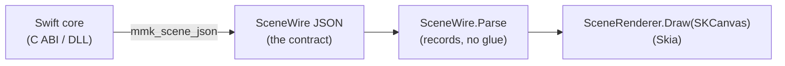

# MermaidKit for Windows / .NET (SkiaSharp renderer)

The .NET side of the Windows bridge (see [`docs/notes/windows.md`](../docs/notes/windows.md)).
It consumes the platform-free **`SceneWire`** scene the Swift core emits
(`mmk_scene_json`) and draws it with **SkiaSharp** — real Skia, the same engine
the Android `Canvas` uses, so Windows output is a fidelity match for Android (no
SVG fallback).



Because [`RenderScene`](../Sources/MermaidLayout/RenderScene.swift) flattens all
30 diagram types into a tiny universal vocabulary (shape / polyline / text + a
theme), this library never learns what a "sequence diagram" is — it paints
primitives in painter's order, exactly like the Android and SVG backends.

## Layout

- `MermaidKit/SceneWire.cs` — the wire model: C# records + small `JsonConverter`s
  that read the `type` discriminator at any position (sorted-key JSON puts it
  last, so `System.Text.Json`'s built-in polymorphism can't be used directly —
  the .NET analogue of Kotlin's `@JsonClassDiscriminator`).
- `MermaidKit/SceneRenderer.cs` — draws a `SceneWire` onto an `SKCanvas`: rounded
  rects / ellipses / polygons / arbitrary paths, stroked + arrowed edge
  polylines, and centered/rotated text with backing chips. Colors are
  `#RRGGBBAA`; text is measured with the same `SKPaint` that draws it.
- `MermaidKit.Tests/` — xUnit tests: the golden JSON the core emits parses via
  the converters and renders real ink on a Skia canvas.

## Build & test

```bash
dotnet test windows/MermaidKit.Tests/MermaidKit.Tests.csproj
```

CI runs this on `windows-latest` (the authoritative target — system fonts render
text there; the headless Linux Skia build draws shapes/strokes but no glyphs).

## Shipped

- **The P/Invoke bridge** — `MermaidNative` binds `[DllImport("MermaidKitCShared")]`
  to `mmk_scene_json` (+ `mmk_narrate` / `mmk_version` / `mmk_free`), so an app passes
  a Mermaid *source string* and gets a `SceneWire` back. `PInvokeTests` covers it and
  CI runs it on `windows-latest` — mirroring Android's JNI seam.

## Not yet here (next slices)

- **Device-font measure callback** — the first P/Invoke slice passes none, so native
  layout uses a coarse glyph-box metric; threading a measure callback through the ABI
  lets layout measure with the face that draws.
- **Theming + a WinUI/WPF control** — `MermaidTheme.FromWindows(...)` across the
  ABI (like `MermaidTheme.fromMaterial` on Android) and an idiomatic control.
